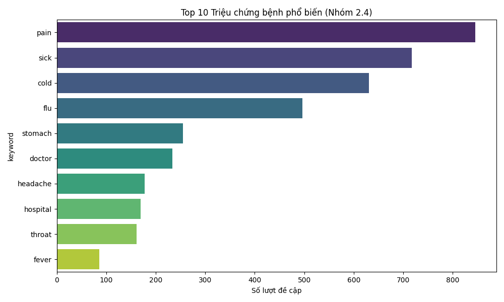
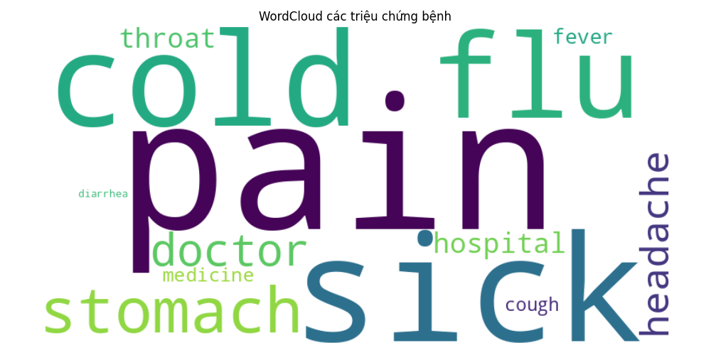
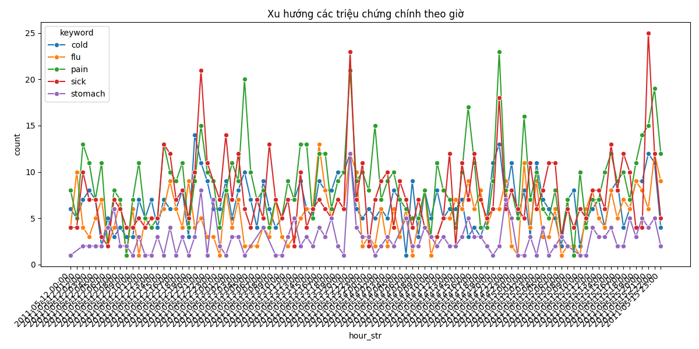
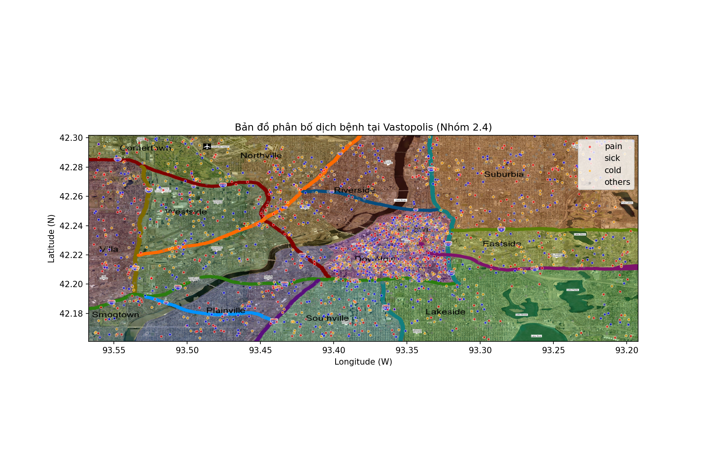
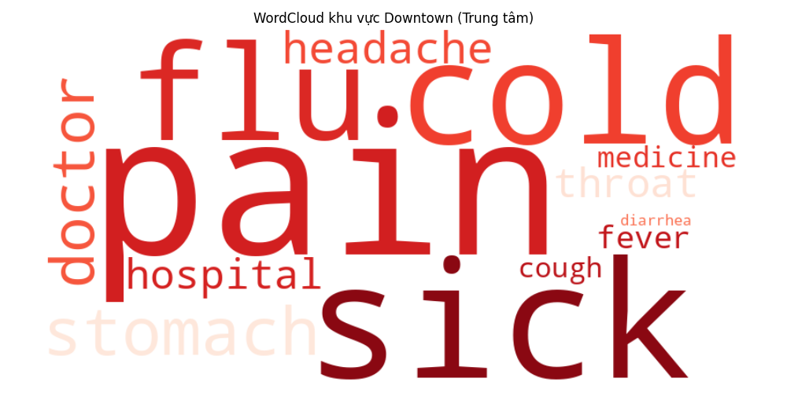

# Vastopolis Epidemic Analysis - Group 2.4 (12/05 - 15/05)

Dự án phân tích dữ liệu lớn nhằm truy vết dịch bệnh tại thành phố Vastopolis, thuộc khuôn khổ môn học **Lập trình xử lý dữ liệu (2025–2026)**. Dự án tập trung vào việc làm sạch, kết nối dữ liệu Microblogs & Thời tiết, và trực quan hóa không gian/thời gian để tìm ra nguồn gốc và quy mô lây lan của dịch bệnh.

---

## 👥 Thành viên Nhóm 2.4
| STT | Họ và tên | Vai trò |
|-----|-----------|---------|
| 1 | **Đinh Mạnh Cường** | Coding, Git Manager |
| 2 | **Trịnh Minh Đức** | Data Cleaning, QA Report |
| 3 | **Dương Đức Minh** | Visualization, Report |

**Phạm vi dữ liệu:** 12/05/2011 - 15/05/2011

---

## 🛠 Quy trình xử lý dữ liệu (Data Pipeline)
Chúng tôi đã xây dựng một pipeline xử lý dữ liệu tự động gồm các bước:

1.  **Data Loading & Filtering:** Lọc dữ liệu Microblogs và Weather đúng khung thời gian phân công (12/5 - 15/5).
2.  **Quality Assurance (QA):** Kiểm tra lỗi định dạng ngày tháng, thiếu tọa độ và xử lý bằng phương pháp loại bỏ (Drop) hoặc gắn cờ.
3.  **Data Merging:** Nội suy dữ liệu thời tiết (Upsampling) và ghép nối với Microblogs.
4.  **Keyword Analysis:** Quét nội dung Blog để tách lọc các từ khóa triệu chứng bệnh (Symptom) và các từ khóa khác.

---

## 📊 Kết quả Phân tích & Trực quan hóa

### 1. Tổng quan triệu chứng (Overview)
Các triệu chứng phổ biến nhất được nhắc đến là **Pain (Đau nhức), Sick (Ốm), Cold (Cảm lạnh), Flu (Cúm)**. Điều này cho thấy đây có thể là một đợt dịch cúm lây lan qua đường hô hấp.

*Biểu đồ tần suất các từ khóa triệu chứng:*


*Đám mây từ khóa (WordCloud):*


### 2. Xu hướng theo thời gian (Time Series)
Biểu đồ dưới đây thể hiện số lượng bài viết về các triệu chứng chính theo từng giờ. Có thể thấy sự gia tăng đột biến vào các khung giờ nhất định.



### 3. Phân bố địa lý (Geospatial Analysis)
Dịch bệnh tập trung dày đặc tại khu vực trung tâm (**Downtown**) và lan rộng sang khu vực **Uptown** dọc theo dòng sông.



#### So sánh triệu chứng theo khu vực
Khi tách dữ liệu thành hai vùng, ta thấy sự khác biệt rõ rệt:
- **Downtown (Vùng lõi):** Các từ khóa "Pain", "Sick", "Flu" xuất hiện với tần suất áp đảo.
- **Ngoại ô:** Số lượng ít hơn và xuất hiện các triệu chứng nhẹ hơn.

| Khu vực Downtown (Vùng dịch) | Khu vực Ngoại ô |
|:---:|:---:|
|  |  |

### 4. Phân tích nâng cao: Mô phỏng lây lan (Timelapse Animation)
Video dưới đây tái hiện lại quá trình bùng phát dịch bệnh theo thời gian thực (từng giờ) trong suốt 4 ngày khảo sát.


---

## 🚀 Hướng dẫn chạy lại (Reproduction)

### Yêu cầu hệ thống
- **Python 3.8+**
- Các thư viện cần thiết: `pandas`, `matplotlib`, `seaborn`, `wordcloud`, `pillow`

### Cài đặt môi trường
```bash
# 1. Clone repository (nếu chưa có)
git clone <link-repo-cua-ban>
cd 2526-LTXLDL-Project-Nhom2.4

# 2. Tạo môi trường ảo (Khuyên dùng)
python3 -m venv venv
source venv/bin/activate  # Trên Windows: venv\Scripts\activate

# 3. Cài đặt thư viện
pip install -r requirements.txt